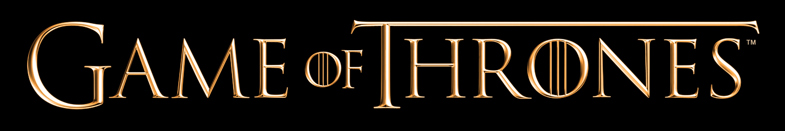

<h1 align="center">Projeto de Analise de Dados Utilizando o Csv da Serie Game of Thrones</h1>

<h4 align="center"> 
    :construction:  Projeto em construção  :construction:
</h4>

#### Projeto final da Trilha de Dados da Formação Dados & Web, cobrindo Análise de Dados, Visualização de Dados e fundamentos de Machine Learning.

##### Tecnologias utilizadas

- `Python`
- `Pandas`
- `Matplotlib`

# Autores

| [ Alberto Henrique](https://github.com/albertolunia) | [ Carlos Juminus](https://github.com/Juminus) |
| :------------------------------------------------------------------------------------------------------------------------------------------: | :-----------------------------------------------------------------------------------------------------------------------------------: |
